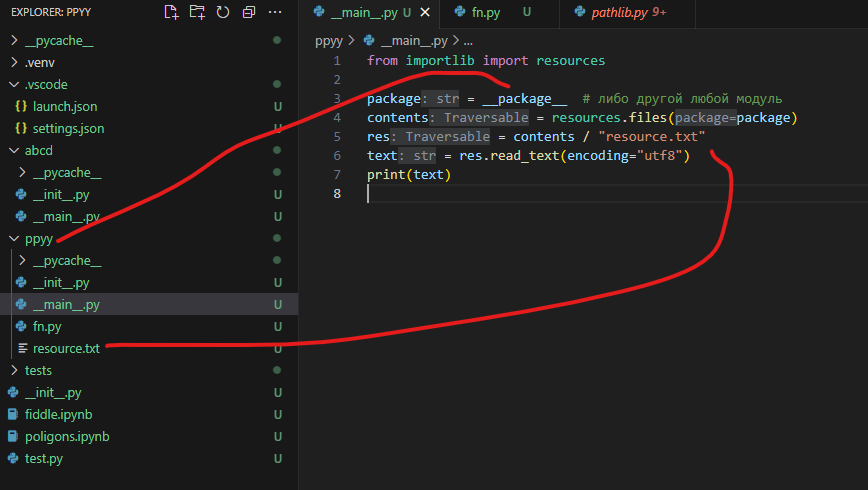

# Доступ к ресурсам модуля


Допустим, нам надо открыть ресурс, расположенный внутри модуля. В нашем примере это *resource.txt*, находящийся в модуле ppyy.

Модули могут поставляться в разных видах (в zip в том числе), и соответственно мы не сможем по-нормальному получить доступ к ресурсам. Однако, при помощи кода ниже, мы можем это сделать:

```python
from importlib import resources

package = __package__ # либо другой любой модуль
contents = resources.files(package)
res = contents / "resource.txt"
text = res.read_text(encoding="utf8")
print(text)
```

